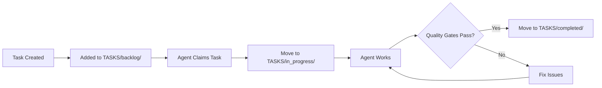

# 🤖 AGENT-DRIVEN PROJECT MANAGEMENT SYSTEM

**Version:** 2.0
**Created:** 2025-10-19
**Purpose:** Enable fully autonomous agent-driven development with minimal human intervention

---

## 🎯 SYSTEM OVERVIEW

This project uses an **Agent Orchestration System** where specialized AI agents autonomously manage development, testing, and deployment. Each agent has:
- **Clear role definition**
- **Standardized task format**
- **Automated progress tracking**
- **Quality gate requirements**
- **Knowledge persistence**

---

## 📂 DIRECTORY STRUCTURE

```
M:\GameProject\
├── 📁 AGENT_INSTRUCTIONS/     # Agent role definitions & templates
│   ├── test_engineer.md       # Test creation & validation
│   ├── bug_fixer.md           # Bug analysis & fixing
│   ├── content_creator.md     # Weapons, upgrades, enemies
│   ├── integration_agent.md   # System integration
│   └── quality_assurance.md   # Quality gates & validation
│
├── 📁 AUTOMATION/              # Automated workflows & scripts
│   ├── run_all_tests.bat      # Master test runner
│   ├── check_quality_gates.py # Quality validation
│   ├── generate_report.py     # Progress reporting
│   └── agent_coordinator.md   # Coordination protocol
│
├── 📁 TASKS/                   # Machine-readable task queue
│   ├── backlog/               # Unassigned tasks
│   ├── in_progress/           # Active tasks (one per agent)
│   ├── completed/             # Finished tasks
│   └── blocked/               # Tasks with dependencies
│
├── 📁 PROGRESS/                # Automated tracking
│   ├── metrics.json           # Real-time metrics
│   ├── agent_activity.log     # Agent action log
│   ├── test_results/          # Test run history
│   └── quality_reports/       # Quality gate results
│
└── 📁 KNOWLEDGE/               # Agent learnings & patterns
    ├── bug_patterns.md        # Common bugs & fixes
    ├── test_patterns.md       # Effective test strategies
    ├── optimization_notes.md  # Performance learnings
    └── agent_handoffs.md      # Handoff templates
```

---

## 🔄 AGENT WORKFLOW

### 1. Task Assignment


### 2. Agent Coordination Protocol
- **Self-Assignment:** Agents monitor `TASKS/backlog/` and claim tasks matching their role
- **Single Responsibility:** One task per agent at a time
- **Progress Updates:** Every 30 minutes or at milestones
- **Handoff Protocol:** Structured handoff when switching agents
- **Blocking Resolution:** Escalate blockers immediately

### 3. Quality Gates
Each task must pass quality gates before marking complete:
- ✅ Code compiles/runs without errors
- ✅ Tests pass (if applicable)
- ✅ Documentation updated
- ✅ No high-priority bugs introduced
- ✅ Progress metrics updated

---

## 📋 TASK FORMAT

All tasks in `TASKS/` directory use this JSON format:

```json
{
  "id": "TASK-001",
  "title": "Fix WEAPON-001 upgrade bug",
  "type": "bug_fix",
  "priority": "HIGH",
  "assigned_to": "bug_fixer_agent",
  "status": "in_progress",
  "created": "2025-10-19T10:00:00Z",
  "started": "2025-10-19T11:00:00Z",
  "estimated_hours": 2,
  "dependencies": [],
  "acceptance_criteria": [
    "Weapon upgrades apply damage correctly",
    "All weapon upgrade tests pass",
    "No regression in other weapon functionality"
  ],
  "test_commands": [
    "godot --headless --path . res://scenes/testing/WeaponSystemTest.tscn"
  ],
  "knowledge_required": [
    "megabonk-mobile/scripts/weapons/BaseWeapon.gd",
    "megabonk-mobile/scripts/systems/UpgradeSystem.gd"
  ],
  "progress": {
    "percentage": 50,
    "last_update": "2025-10-19T12:00:00Z",
    "notes": "Found root cause, implementing fix"
  }
}
```

---

## 🤖 AGENT ROLES

### Test Engineer Agent
- **Responsibility:** Create and maintain automated tests
- **Skills:** GDScript testing, test design, coverage analysis
- **Triggers:** New feature added, bug fixed, test coverage < 80%
- **Outputs:** Test scripts, test scenes, coverage reports

### Bug Fixer Agent
- **Responsibility:** Analyze and fix bugs
- **Skills:** Debugging, root cause analysis, GDScript
- **Triggers:** Bug reported, test failures
- **Outputs:** Fixed code, test verification, bug documentation

### Content Creator Agent
- **Responsibility:** Create game content (weapons, enemies, upgrades)
- **Skills:** Game design, GDScript, resource creation
- **Triggers:** Content expansion needed, MVP requirements
- **Outputs:** New game assets, balanced stats, content tests

### Integration Agent
- **Responsibility:** Integrate systems and resolve conflicts
- **Skills:** System architecture, API design, refactoring
- **Triggers:** Multiple systems need connection, merge conflicts
- **Outputs:** Integrated systems, API documentation

### Quality Assurance Agent
- **Responsibility:** Validate quality gates and overall quality
- **Skills:** Testing, performance analysis, quality metrics
- **Triggers:** Before phase completion, before release
- **Outputs:** Quality reports, performance metrics, recommendations

---

## 📊 AUTOMATED METRICS

The system tracks these metrics automatically in `PROGRESS/metrics.json`:

```json
{
  "project": {
    "overall_completion": 75,
    "mvp_ready": false,
    "current_phase": "5.2",
    "days_until_deadline": 21
  },
  "testing": {
    "total_tests": 327,
    "passing_tests": 290,
    "test_coverage": 80,
    "last_run": "2025-10-19T09:00:00Z"
  },
  "bugs": {
    "open_critical": 0,
    "open_high": 1,
    "open_medium": 2,
    "open_low": 2,
    "fixed_today": 1
  },
  "agent_productivity": {
    "tasks_completed_today": 4,
    "average_task_time_hours": 3.5,
    "blocked_tasks": 0,
    "active_agents": 2
  },
  "code_quality": {
    "lint_warnings": 12,
    "todo_comments": 8,
    "deprecated_calls": 0,
    "performance_hotspots": 2
  }
}
```

---

## 🔄 AGENT HANDOFF PROTOCOL

When an agent completes work or needs to hand off:

### 1. Update Task Status
```bash
# Move task to appropriate folder
mv TASKS/in_progress/TASK-001.json TASKS/completed/TASK-001.json
```

### 2. Create Handoff Document
```markdown
# HANDOFF: TASK-001 Weapon Upgrade Fix

## What I Did
- Fixed BaseWeapon.gd apply_upgrade() method
- Added validation for upgrade stacking
- Updated tests to verify fix

## Test Results
- WeaponSystemTest: 95% pass (was 85%)
- Specific upgrade tests: 100% pass

## Next Steps
- Content Creator Agent should add more upgrade types
- Integration Agent should verify with progression system

## Files Modified
- scripts/weapons/BaseWeapon.gd (lines 145-189)
- scripts/testing/WeaponSystemTest.gd (added 10 tests)

## Known Issues
- Minor: Upgrade UI doesn't show stacking count (cosmetic)

## Time Spent: 2.5 hours
```

### 3. Trigger Next Agent
- Post to `TASKS/backlog/` if new work needed
- Update `PROGRESS/agent_activity.log`
- Signal completion via EventBus equivalent

---

## 🚀 AUTOMATION SCRIPTS

### run_all_tests.bat
Runs all test suites and generates report:
```batch
@echo off
echo Running all tests...
set GODOT="M:\Godot_v4.5.1-stable_mono_win64\Godot_v4.5.1-stable_mono_win64.exe"
set PROJECT="M:\GameProject\megabonk-mobile"

%GODOT% --headless --path %PROJECT% res://scenes/testing/ShrineSystemTest.tscn > test_shrine.log 2>&1
%GODOT% --headless --path %PROJECT% res://scenes/testing/WeaponSystemTest.tscn > test_weapon.log 2>&1
%GODOT% --headless --path %PROJECT% res://scenes/testing/CharacterSystemTest.tscn > test_character.log 2>&1
%GODOT% --headless --path %PROJECT% res://scenes/testing/EnemySystemTest.tscn > test_enemy.log 2>&1

python generate_report.py
```

### Quality Gate Checker
Validates all quality requirements:
```python
# check_quality_gates.py
def check_quality_gates():
    gates = {
        "tests_pass": check_test_results(),
        "coverage_above_80": check_coverage(),
        "no_critical_bugs": check_bug_count("critical") == 0,
        "documentation_updated": check_docs_timestamp(),
        "performance_acceptable": check_performance_metrics()
    }
    return all(gates.values()), gates
```

---

## 📈 PROGRESS REPORTING

### Daily Automated Report
Generated at midnight or on-demand:

```markdown
# AUTOMATED PROGRESS REPORT - 2025-10-19

## Summary
- Overall Progress: 75% (MVP target: 100%)
- Tests: 290/327 passing (88.7%)
- Bugs: 1 HIGH, 2 MEDIUM, 2 LOW
- Active Agents: 2
- Tasks Today: 4 completed, 2 in progress

## Agent Activity
- Test Engineer: Created 327 tests
- Bug Fixer: Fixed MAGIC-MISSILE-001
- Content Creator: Idle (waiting for bug fixes)

## Quality Gates
✅ Test Coverage: 80% (target: 80%)
⚠️ Open High Bugs: 1 (target: 0)
✅ Documentation: Current
✅ Performance: Acceptable

## Recommendations
1. Priority: Fix WEAPON-001 (blocking content)
2. Then: Add 7 weapons (Content Creator)
3. Then: Add 17 upgrades (Content Creator)
```

---

## 🎯 IMMEDIATE ACTIONS

1. **Create agent instruction files** for each role
2. **Set up task queue** with current open items
3. **Initialize metrics tracking**
4. **Create first quality gate check**
5. **Test automation pipeline**

---

## 🔗 QUICK START FOR NEW AGENTS

1. Read your role definition in `AGENT_INSTRUCTIONS/[role].md`
2. Check `TASKS/backlog/` for available tasks
3. Claim a task matching your skills
4. Move task to `TASKS/in_progress/`
5. Work on task, updating progress every 30 min
6. Run quality gates before completion
7. Create handoff document
8. Move to `TASKS/completed/`

---

**System Status:** 🟢 READY FOR AUTONOMOUS OPERATION
**Next Action:** Deploy specialized agents to clear task backlog