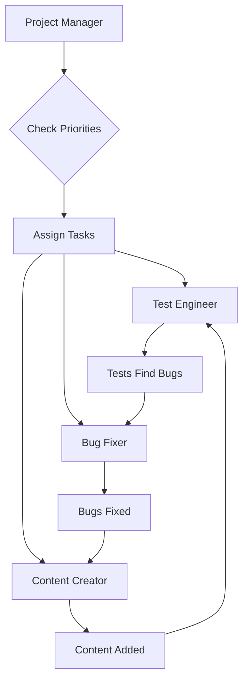

# 🤝 AGENT COORDINATION PROTOCOL

**Purpose:** Define how agents work together autonomously
**Version:** 1.0
**Status:** ACTIVE

---

## 🎭 AGENT ROSTER

| Agent | Role | Trigger | Priority |
|-------|------|---------|----------|
| Test Engineer | Create/maintain tests | Coverage < 80% | HIGH |
| Bug Fixer | Fix bugs | Bugs reported | CRITICAL |
| Content Creator | Add game content | Post-bugfix | HIGH |
| Integration Agent | System integration | Conflicts | MEDIUM |
| Quality Assurance | Quality validation | Pre-release | HIGH |

---

## 🔄 COORDINATION WORKFLOW



---

## 📋 TASK ASSIGNMENT RULES

### Priority Order
1. **CRITICAL bugs** → Bug Fixer
2. **HIGH bugs** → Bug Fixer
3. **Test coverage gaps** → Test Engineer
4. **Content creation** → Content Creator (if no bugs)
5. **Integration issues** → Integration Agent
6. **Quality checks** → QA Agent

### Concurrency Rules
- **Maximum 1 task per agent**
- **No parallel work on same files**
- **Test after every major change**
- **Quality gates before phase transitions**

### Blocking Rules
- **Content blocked by HIGH bugs**
- **Tests blocked by active development**
- **Integration blocked by incomplete features**
- **Release blocked by quality gates**

---

## 💬 AGENT COMMUNICATION

### Task Claim Message
```json
{
  "agent": "bug_fixer",
  "action": "claim_task",
  "task_id": "TASK-001",
  "timestamp": "2025-10-19T12:00:00Z",
  "estimated_completion": "2025-10-19T14:00:00Z"
}
```

### Progress Update Message
```json
{
  "agent": "bug_fixer",
  "action": "progress_update",
  "task_id": "TASK-001",
  "percentage": 50,
  "notes": "Root cause identified, implementing fix",
  "blockers": []
}
```

### Task Complete Message
```json
{
  "agent": "bug_fixer",
  "action": "task_complete",
  "task_id": "TASK-001",
  "results": {
    "tests_pass": true,
    "files_changed": ["BaseWeapon.gd"],
    "new_bugs": 0
  },
  "handoff": "content_creator can now proceed"
}
```

### Escalation Message
```json
{
  "agent": "test_engineer",
  "action": "escalation",
  "issue": "Critical bug found",
  "severity": "CRITICAL",
  "details": "Game crashes when...",
  "recommendation": "Stop all work, fix immediately"
}
```

---

## 🚦 AGENT STATES

Each agent can be in one of these states:

| State | Description | Can Accept Tasks |
|-------|-------------|------------------|
| IDLE | No active task | Yes |
| WORKING | Task in progress | No |
| BLOCKED | Waiting for dependency | No |
| TESTING | Running validation | No |
| HANDOFF | Transferring work | Yes |
| ERROR | Problem encountered | No |

---

## 🔐 QUALITY GATES

Before any agent marks task complete:

### Code Quality Gates
- [ ] Code compiles without errors
- [ ] No new warnings introduced
- [ ] Follows project conventions
- [ ] Comments added for complex logic

### Test Quality Gates
- [ ] All related tests pass
- [ ] Test coverage maintained/improved
- [ ] No test regressions
- [ ] Performance benchmarks met

### Documentation Gates
- [ ] Code comments updated
- [ ] README updated if needed
- [ ] API docs updated if changed
- [ ] Handoff notes created

---

## 📊 COORDINATION METRICS

Track these automatically:

```json
{
  "coordination_metrics": {
    "active_agents": 2,
    "idle_agents": 3,
    "tasks_in_progress": 2,
    "tasks_blocked": 1,
    "average_task_time": 3.5,
    "handoff_success_rate": 95,
    "conflict_rate": 2,
    "escalations_today": 0
  }
}
```

---

## 🔄 HANDOFF PROCEDURES

### Standard Handoff
1. Completing agent updates task status
2. Creates handoff document
3. Moves task to completed/
4. Notifies next agent
5. Next agent claims follow-up task

### Emergency Handoff
1. Agent encounters critical issue
2. Documents current state
3. Escalates to Project Manager
4. PM assigns to specialist
5. Specialist takes over immediately

### End-of-Session Handoff
1. Agent summarizes work done
2. Lists pending items
3. Notes any blockers
4. Suggests next actions
5. Updates all documentation

---

## ⚡ CONFLICT RESOLUTION

### File Conflicts
- Last agent to modify wins
- Previous agent must merge
- Use version control when available

### Task Conflicts
- Higher priority task wins
- Lower priority moved to backlog
- PM makes final decision

### Resource Conflicts
- Test environment: Test Engineer priority
- Production code: Bug Fixer priority
- Documentation: Current task owner

---

## 🎯 AGENT TRIGGERS

### Automatic Activation
```python
def check_agent_triggers():
    triggers = {
        "test_engineer": lambda: coverage < 80 or new_features > 0,
        "bug_fixer": lambda: critical_bugs > 0 or high_bugs > 0,
        "content_creator": lambda: bugs == 0 and content < mvp_target,
        "integration_agent": lambda: conflicts > 0 or apis_changed,
        "qa_agent": lambda: phase_complete or pre_release
    }

    for agent, condition in triggers.items():
        if condition():
            activate_agent(agent)
```

---

## 📝 COORDINATION LOG FORMAT

All agent actions logged to `PROGRESS/agent_activity.log`:

```
[2025-10-19 12:00:00] [bug_fixer] CLAIM task TASK-001
[2025-10-19 12:30:00] [bug_fixer] UPDATE task TASK-001 50% complete
[2025-10-19 13:00:00] [test_engineer] START automated test run
[2025-10-19 13:15:00] [test_engineer] FOUND 2 test failures
[2025-10-19 14:00:00] [bug_fixer] COMPLETE task TASK-001
[2025-10-19 14:01:00] [content_creator] ACTIVATE waiting for tasks
```

---

## 🚀 QUICK COORDINATION COMMANDS

```bash
# Check agent status
python check_agent_status.py

# Assign task to agent
python assign_task.py TASK-001 bug_fixer

# Check for conflicts
python detect_conflicts.py

# Generate coordination report
python coordination_report.py

# Emergency stop all agents
python emergency_stop.py
```

---

## ⚠️ COORDINATION RULES

1. **No agent works without a task**
2. **One task per agent at a time**
3. **Always check dependencies**
4. **Test after every change**
5. **Document everything**
6. **Escalate blockers immediately**
7. **Quality gates are mandatory**
8. **Handoffs must be complete**

---

**Protocol Status:** ACTIVE
**Last Updated:** 2025-10-19
**Next Review:** After first full cycle